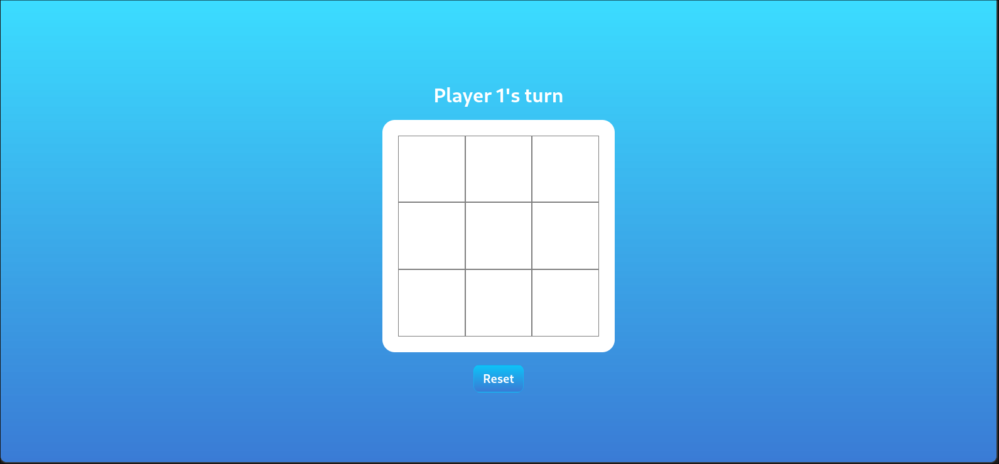

# Tic Tac Toe Game

This repository contains the code for a simple Tic Tac Toe game implemented in HTML, CSS, and JavaScript. The goal of the project is to build a functional game with a clean and organized code structure, utilizing concepts such as object-oriented programming and modularization.

## Project Structure

The project is organized into three main components:

1. **Gameboard Object:**
   - The gameboard is represented as an array inside a `Gameboard` object.
   - The `Gameboard` object manages the state of the gameboard and provides methods to check for winning conditions and game completion.

2. **Player Objects:**
   - Players are represented as objects, each having a name and a marker ('X' or 'O').
   - Player objects encapsulate player-related functionality, such as making moves on the gameboard.

3. **Game Control Object:**
   - The flow of the game is controlled by a central `Game` object.
   - This object orchestrates the game, handling player turns, checking for winners, and managing the overall game state.

## Implementation Details

- The project follows the module pattern to encapsulate logic within factories and limit global code.
- The initial focus is on creating a functional game in the console, ensuring that the game logic works correctly.
- The code is structured logically, with each component responsible for its specific functionality.
- The DOM-related functionality is separated into a display controller object that handles rendering the gameboard and interacting with the user interface.
- Players can input their names, and the game includes a button to start/restart the game.
- The interface is designed to provide a clean and intuitive user experience.

## Preview

## Live preview
Demo [demo] (https://facu18xk.github.io/odin-ticTacToe/) 

